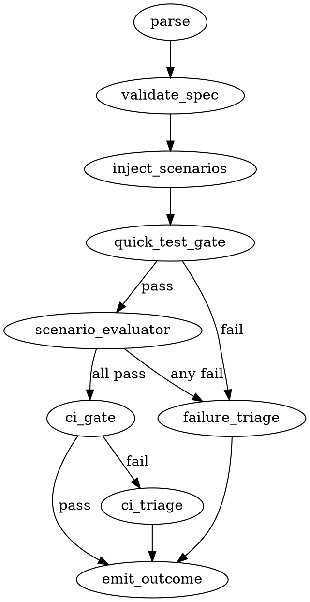

# Darkfactory Plan — `platformer/`

A concrete adaptation of the Rivshield dark-factory pipeline (spec-generator + attractor + orchestrator) for this repo's `platformer/` directory.

Source skills inspected:
- `../../rivshield/.claude/skills/rivshield-spec-generator/SKILL.md`
- `../../rivshield/.claude/skills/rivshield-darkfactory/SKILL.md`
- `../../rivshield/darkfactory/attractor/spec-template.md`
- `../../rivshield/darkfactory/{specs,attractor}` directory layout

The goal of this plan is to specify (1) the directory layout we will mirror, (2) the spec-generation skill adapted to platformer, (3) the orchestrator pipeline adapted to a static browser game (no AWS/CDK, no Windows agent), and (4) the host-side prerequisites needed before the first run.

---

## 1. What is the same vs different vs Rivshield

| Concern | Rivshield | Platformer |
|---|---|---|
| Codebase shape | C# agent + AWS Lambda + React dashboard | Vanilla ES-module JS + Canvas, single static page |
| Build | `pnpm`, `dotnet`, CDK deploy | None — open `platformer.html` |
| Test runner | xUnit + PowerShell + Playwright | Jest (suggested, à la `tic-tac-toe-bot/`) + Playwright optional |
| Deploy target | `pnpm deploy:click` → AWS | Copy to `dist/` and/or GitHub Pages publish |
| Host-side verification | AWS DynamoDB + Playwright against `.click` | Playwright against `file://` or `python -m http.server` |
| Windows Sandbox (Phase E.5) | Yes, agent install verify | **Skipped** — no installer |
| Holdout enforcement | Tool-layer `permissions.deny` + Bash hook + canary | **Same model, retained** |
| Coding-agent subprocess | `claude -p` in `$repoRoot` | `claude -p` in `platformer/` |
| Integration branch | `specs` long-lived branch on origin | `platformer-specs` long-lived branch (avoid collision with other projects in this monorepo-of-projects) |

Everything below assumes the platformer is treated as the unit of work — pipeline state, branches, and queue all scope to `platformer/`.

---

## 2. Directory layout to create

Inside `platformer/`:

```
platformer/
  darkfactory/
    specs/                            # coding-agent-visible specs
      completed/                      # archived after promotion
    DARKFACTORY-INSTRUCTIONS.md       # human-facing runbook
    attractor/                        # ALREADY EXISTS — engine lives here
      attractor.js
      package.json
      src/
      tests/                          # engine self-tests (NOT product tests)
      scripts/
        emit-outcome.ps1              # copy from rivshield engine
      config/
        auto-resolve.json             # CI-bot-regenerated allow-list
      checkpoints/                    # IPC files: last-outcome.json, etc.
      pipelines/
        platformer.dot                # new DOT pipeline (see §5)
  tests/
    scenarios/                        # evaluator-only holdout, .gitignored from coding-agent reads
    unit/                             # Jest unit tests (written by test-writer agent)
    playwright/                       # optional E2E (written by test-writer agent)
  .claude/
    hooks/
      deny-tests-in-bash.ps1          # same hook as Rivshield, scoped to platformer/tests
    settings.json                     # written per-run by holdout-setup; deleted in teardown
  package.json                        # adds jest, @playwright/test as devDeps
```

`tests/scenarios/` is the holdout dir. The coding agent must never read it; the test-writer agent and evaluator do.

---

## 3. Host-side prerequisites (one-time)

Mirror Rivshield's "Initial setup" section, scoped down:

1. **Integration branch.** Create `platformer-specs` from `main`:
   ```powershell
   git fetch origin
   git switch -c platformer-specs origin/main
   git push -u origin platformer-specs
   git switch main
   ```
   The pipeline will refuse to start if `origin/platformer-specs` is missing.

2. **Bash deny-hook.** Copy `.claude/hooks/deny-tests-in-bash.ps1` verbatim from `rivshield/.claude/hooks/`. The path patterns (`tests/`, `scenarios/`, `git stash|reflog|fsck`, `git worktree add`) apply unchanged.

3. **Playwright (optional but recommended).**
   ```powershell
   cd platformer
   pnpm install
   pnpm exec playwright install chromium
   ```
   Only needed if any spec produces a UI scenario worth driving in a real browser. For pure-logic specs (physics, level-gen, shop math) the evaluator reads code and Playwright is skipped.

4. **Engine deps:**
   ```powershell
   cd platformer/darkfactory/attractor
   pnpm install
   ```
   Phase A.2's idempotent install will redo this if `node_modules/` is missing.

5. **Auto-resolve allow-list.** Create `platformer/darkfactory/attractor/config/auto-resolve.json`:
   ```json
   {
     "take_specs":           ["platformer/docs/TEST-REPORT.md"],
     "take_theirs_on_rebase":["platformer/docs/TEST-REPORT.md"]
   }
   ```
   Empty/`[]` is fine until a CI-bot regenerated file actually causes recurring conflicts.

6. **What we DO NOT need.** AWS credentials, `Get-TestBackdoorOtp.ps1`, Windows Sandbox feature, CDK. The pipeline branches that reference those (Phase C deploy, Phase E.5, scenario backdoor-OTP) are removed or stubbed (see §6).

---

## 4. Spec-generator skill — `platformer-spec-generator`

Adapt the Rivshield spec-generator with these changes:

### 4.1 Two artifacts per spec (unchanged model)

- `platformer/darkfactory/specs/{slug}.md` — coding-agent-visible
- `platformer/tests/scenarios/{slug}.md` — evaluator-only holdout

The neutral test-writer agent (run inside the pipeline, not by this skill) reads both and emits Jest / Playwright tests at run time. The spec author never writes test files.

### 4.2 Step 1 — context-gathering questions (rewritten)

Round 1 — What and why:
1. What is the feature or change? (1–3 sentences)
2. Why is it needed? (player request / bug / new mechanic / polish)
3. Which subsystem(s) does it touch? (physics, level-gen, rendering, UI, state/save, input)

Round 2 — Scope and quality:
4. What does success look like to a player?
5. Hard constraints? (must run at 60fps, no new deps, must work on Firefox + Chromium)
6. Risk of regressing existing 500 levels / 10 stage themes? (yes/no — guides scenario list)
7. Priority? (nice-to-have / needed soon / blocking)

Round 3 — Large-feature check:
If the feature touches **all of**: physics + level-gen + UI + state save format, stop and ask the user to split. This is the platformer analog of Rivshield's agent+server+dashboard rejection.

Round 4 — UI intake:
If the feature changes any visible HUD/menu/canvas overlay (not gameplay rendering itself), invoke `frontend-design`. The platformer's dark/gold theme is documented in `platformer.css` — reuse classes rather than introducing new ones.

### 4.3 Step 2 — Sizing

| Size | Signals |
|---|---|
| **Tiny** | Single function in one js file, no new entities, ≤2 scenarios |
| **Small** | One subsystem (e.g. add a new upgrade), ≤4 scenarios |
| **Medium** | New entity type + spawn logic + collision + render path, ≥4 scenarios |
| **Large** | Rejected — split |

### 4.4 Step 3 — Component map

| Described area | File(s) |
|---|---|
| Player physics, jump, double-jump | `js/player.js`, `js/input.js` (jump buffer + coyote) |
| Coins, doors, particles, enemies | `js/entities.js` |
| Procedural level | `js/level.js` (seeded RNG, resolveX/Y) |
| Stage themes / backgrounds | `js/renderer.js` (10 themes) |
| Save data, upgrades, coins | `js/state.js` (localStorage) |
| HUD, shop, menus | `js/ui.js`, `platformer.css`, `platformer.html` |
| Game loop, level lifecycle | `js/main.js` |

The spec's `## Affected Components` section MUST list **paths**, never bare names — same prefix-grammar rule as Rivshield, because the scope-gate and holdout-setup parse them as prefixes.

### 4.5 Spec template

Same template as Rivshield (Goal / Requirements / Examples / Edge Cases / Constraints / Affected Components / Interface Contracts / Out of Scope / Depends On / UI Design / Security Considerations / Open Questions / Priority).

Differences in `Interface Contracts` for a browser game:
- Replace API/DynamoDB lines with module-level handles:
  - `state.playerData.upgrades` — read/written for upgrade purchases
  - `entities.spawnCoin(level, rng)` — called by `level.generate`
  - `localStorage["platformer-save"]` — JSON shape `{ coins, upgrades, stage, level }`

`Security Considerations` is usually `None`; keep the section for parity.

### 4.6 Self-review gate

Identical to Rivshield's gate. The "no scenarios in spec file" rule is load-bearing — it is what keeps the holdout intact.

### 4.7 Branch + commit

```powershell
git switch -c spec/{slug}                                # collision check first
git add platformer/darkfactory/specs/{slug}.md `
        platformer/tests/scenarios/{slug}.md
git commit -m "spec: add {Feature Title}"
git push -u origin spec/{slug}
git switch -
```
Slug-collision check against `origin/main:platformer/darkfactory/specs/{slug}.md` is the same as Rivshield's check, just path-prefixed.

---

## 5. Pipeline — `platformer-darkfactory`

### 5.1 Queue Mode (unchanged structure)

Enumerate `origin/spec/*` branches that touch the `platformer/` path:

```powershell
git fetch origin
git branch -r --list 'origin/spec/*' | ForEach-Object {
    $branch = $_.Trim() -replace '^origin/', ''
    # Only platformer specs: file exists at platformer/darkfactory/specs/{slug}.md on that branch
    $slug = $branch -replace '^spec/', ''
    git cat-file -e "origin/$branch:platformer/darkfactory/specs/$slug.md" 2>$null
    if ($LASTEXITCODE -eq 0) { $branch }
}
```

Topologically sort by each spec's `## Depends On`. Empty queue → exit message. Cycle → "queue stalled".

### 5.2 Queue Loop per slug

For each `{slug}`:

1. **Phase A** — sanity.
2. **Phase B** — engine iteration (rebase → test-writer → holdout-setup → coding-agent loop → evaluator).
3. **Phase C** — merge to `platformer-specs`, push. **No deploy step** — instead, a thin `phase-C verify-static-load` agent (see §5.5) opens `platformer.html` via headless Playwright and confirms the page boots without runtime errors.
4. **Phase E** — host-side scenario drive (only for scenarios marked as `kind: e2e`; logic scenarios are already covered by the engine's evaluator).
5. Loop.

**Snapshot-rebuild gate is removed** — there is no Hyper-V snapshot. The platformer has no analog.

### 5.3 Phase A adaptations

Drop: dotnet build smokes, AWS credentials, backdoor wrapper, Windows Sandbox check.
Keep: spec section completeness, scenarios-file non-empty, scenario-inject sentinel absence, clean checkpoint dir, stale `.claude/settings.json` teardown, orphan untracked test-file detection, holdout hook present, Playwright (only if any scenario in this slug is `kind: e2e`).

Add:
- **Jest smoke**: `pnpm --filter platformer exec jest --listTests` must succeed (catches broken Jest config before the test-writer agent runs).
- **HTML / module load smoke**: `node -e "import('./platformer/js/main.js')"` against a JSDOM stub — optional; cheap version is letting Phase C's static-load agent be the smoke.

### 5.4 Phase B — engine + holdout

Identical state machine to Rivshield:
- B.1 rebase agent against `origin/main`, with auto-resolve allow-list.
- B.3 test-writer agent — has access to both spec and `tests/scenarios/{slug}.md`; writes Jest test files into `platformer/tests/unit/` (and `platformer/tests/playwright/` if applicable) **into the working tree, uncommitted**.
- B.4 holdout-setup agent — writes `platformer/.claude/settings.json` with `permissions.deny` patterns:
  ```
  platformer/tests/**
  platformer/**/scenarios/**
  platformer/.claude/**
  ```
  plus the `PreToolUse` Bash hook. Same canary `HOLDOUT-SELFTEST` line the audit greps for.
- B.5 coding-agent supervisor launches `claude -p --verbose --output-format stream-json` in `platformer/` so the directory-scoped settings actually apply. Reads only spec + `js/` source. Edits `js/`, `platformer.css`, `platformer.html`. Forbidden from reading `tests/`.
- B.5.2 audit scans the flattened transcript for `HOLDOUT-SELFTEST: PASS` and any denial markers.
- B.5.3 evaluator agent invokes the engine (`node platformer/darkfactory/attractor/attractor.js platformer/darkfactory/attractor/pipelines/platformer.dot`) which runs:
  1. Quick test gate: `pnpm --filter platformer exec jest --runInBand`.
  2. Scenario evaluator: reads spec (with injected `## Scenarios` section pulled from `tests/scenarios/{slug}.md`), reads referenced source files, emits per-scenario PASS/FAIL and triage feedback.
  3. CI gate: lint + jest, same as the quick gate; for browser-only mechanics, optional Playwright run against `platformer.html` served from `python -m http.server 8123` (started + torn down by the gate node).
  4. Emit `last-outcome.json` via `emit-outcome.ps1`.

  Inline `try/finally`: orchestrator strips injected scenarios from the spec on every exit path.

- B.5.4 scope-gate / B.5.4a investigator — identical contracts.
- B.6 teardown — delete `platformer/.claude/settings.json`, `git clean -fdx -- platformer/tests/` to discard the uncommitted test-writer output if the iteration failed.

### 5.5 Phase C — push, merge, "deploy"

- C.1 push `spec/{slug}` (force, since rebased).
- C.2 merge `spec/{slug}` → `platformer-specs` with `--no-ff` and `ci: merge {slug}` message. Auto-resolve uses `take_specs` allow-list.
- C.3 push `platformer-specs`.
- C.4 **No CDK deploy.** Instead spawn `phase-C verify-static-load` agent:
  - `python -m http.server 8123 --directory platformer` in background.
  - `pnpm exec playwright test --headed=false` against `http://localhost:8123/platformer.html`, with one canned check: "page loads, `window.gameState` exists after `DOMContentLoaded`, no uncaught errors in 5s".
  - Tear down server.

  A failed static-load = same outcome class as a failed AWS deploy: log, `continue` to next slug, no `ci: merge` retained on `platformer-specs`.

- C.5 doc-update agent (optional) — updates `CLAUDE.md`'s `## Recent Features (platformer)` section.

### 5.6 Phase E — scenario drive (gating)

For each scenario in `tests/scenarios/{slug}.md` that has frontmatter `kind: e2e`:
- E.2 setup agent — primes localStorage with required save state via a Playwright `page.evaluate(() => localStorage.setItem(...))` shim.
- E.2 test agent — drives the canvas with `page.keyboard.press`, asserts the `Then:` outcome (e.g. "player reaches y < 200 within 3s"), collects screenshots + console.
- E.2 diagnose-fix agent — same fixable/unfixable contract.
- Up to 10 rounds per scenario.

Scenarios without `kind: e2e` are already PASS/FAIL by the engine's scenario evaluator in B.5.3 and need nothing here.

**Phase E.5 (agent install verify) is removed entirely** — there is no installer.

At end of Phase E emit `ci: e2e {slug} pass|fail|skip` empty-tree commit on `platformer-specs`, same load-bearing-record pattern.

### 5.7 Phase D — batched review

After queue empties, surface a table:

| slug | engine outcome | static-load | e2e (n passed / n total) | promotion choice |
|---|---|---|---|---|

User picks approve / reject / Q&A per row. Approve → Promotion merges `spec/{slug}` into `main` in queue order.

### 5.8 Promotion + archive

Same as Rivshield: merge spec branches to `main`, then move `platformer/darkfactory/specs/{slug}.md` → `platformer/darkfactory/specs/completed/{slug}.md` on `main`. Rejected slugs get a `{slug}.rejected.md` tombstone on `platformer-specs`.

---

## 6. What we removed from Rivshield (and why it's safe)

| Removed | Reason it's safe |
|---|---|
| AWS Lambda backdoor OTP | No auth surface in a static game |
| CDK / `pnpm deploy:click` | No backend to deploy |
| Windows Sandbox Phase E.5 | No native installer |
| Hyper-V snapshot rebuild gate | No VM-based integration tests |
| Dashboard build smoke | Replaced with Jest config smoke |
| dotnet warm builds | Not a .NET project |
| `git stash/reflog/fsck` denies | KEPT — same defense-in-depth applies |
| `git worktree add` deny | KEPT — holdout escape still possible without it |

---

## 7. DOT pipeline shape (`platformer.dot`, sketch)



Node types reused from existing `attractor/src/pipeline/`:
- `parse` / `validate_spec` — built-in.
- `inject_scenarios` — file-merge node already present.
- `quick_test_gate`, `ci_gate` — shell exec nodes running `pnpm jest`.
- `scenario_evaluator` — LLM codergen node, reads source files referenced by `Verify by:`.
- `failure_triage`, `ci_triage` — LLM codergen → write `outcome-verdict.txt` + `triage-feedback.txt`.
- `emit_outcome` — `emit-outcome.ps1` tool node, writes `last-outcome.json`.

---

## 8. Open items for the user before first run

1. Pick the integration branch name: `platformer-specs` (recommended, namespaced) vs reusing Rivshield's `specs` (collision risk in shared repos).
2. Decide whether to wire Playwright at all on day one, or defer until the first `kind: e2e` scenario actually appears.
3. Decide whether the spec generator should live as a separate skill under `.claude/skills/platformer-spec-generator/` in **this** repo, or in the user's global `~/.claude/skills/`. Recommendation: in-repo, so the prefix-grammar paths and component map travel with the project.
4. Confirm: no GitHub Pages auto-deploy needed in Phase C? (The hub `index.html` is on Pages; if a merged platformer spec must auto-publish, add a thin `phase-C publish` agent that runs `git push origin main:gh-pages` after Promotion, not after C.2.)

---

## 9. First milestone to validate the pipeline end-to-end

Pick a Tiny spec that exercises every phase without depending on much:

> **"Player can press `R` to instantly restart the current level without losing collected upgrades."**

- Touches: `js/input.js`, `js/main.js`, possibly `js/state.js`.
- 2 scenarios:
  1. R while alive resets `player.x/y` and clears in-flight particles; upgrades persist.
  2. R while on the level-complete overlay does nothing (must-NOT-happen / constraint).
- Verifiable from code alone (no e2e needed).
- Runs the full B → C → D path including holdout, test-writer, evaluator, static-load verification, and promotion.

If that round-trips green, the pipeline is wired correctly and we can graduate to Medium specs (new enemy types, new stage themes, save-format migrations).
